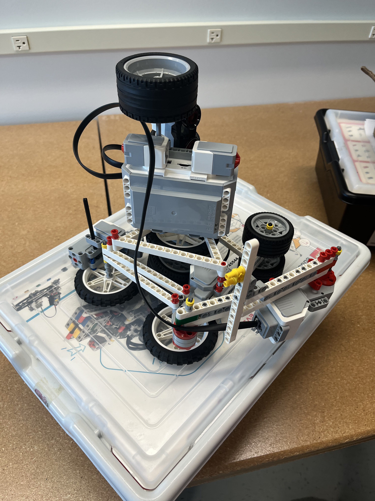

# EV3 Robotic Arm 
Python program to use an EV3 arm to draw a shape using the provided euclidian co-ordinates points 

## Steps to run 
1. Install Python on EV3 brick 
2. Install EV3 extension on VsCode
3. Create a new project and (copy, fork, or download) the code to main.py file 
4. Edit the points in the main.py that corresponds to a figure 
5. Connect the EV3 robot and run the program using the run and debug section

## User stories
- Any points that corresponds to a sequence of points can be entered to the system 
- User can place any size of pen in the system 

## Demo 
<iframe width="auto" height="auto" src="https://www.youtube.com/embed/6Q6zVgK3VDI" title="YouTube video player" frameborder="0" allow="accelerometer; autoplay; clipboard-write; encrypted-media; gyroscope; picture-in-picture" allowfullscreen></iframe>

 
## Future implementations
- Make the lifting and placement of robotic arm autonomous 
